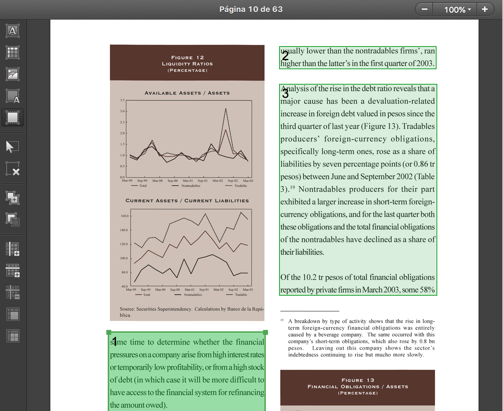

# Indices de Sentimiento y Medidas de complejidad del lenguaje - Aplicación a los Reportes de Estabilidad Financiera

## Objetivos
Cálculo del *ISREF* para los Reportes de Estabilidad Financiera, producidos por el Banco de la República de Colombia, que han sido traducidos a inglés.

Cálculo de medidas de Complejidad del Lenguaje para cada reporte.

## Antecedentes

### FSS
Investigadores de  la FED publicaron en 2017 un Discussion Paper llamado
[Sentiment in Central Bank's Financial Stability Reports](https://www.federalreserve.gov/econres/ifdp/files/ifdp1203.pdf), en el que construyen un índice que mide el sentimiento expresado en el texto de los Reportes de Estabilidad Financiera publicados por diferentes bancos centrales en el período 2005 - 2015.

El *FSS index* se calcula, para cada reporte, como la diferencia entre la cantidad de palabras negativas y positivas, relativo a la cantidad total de palabras que lo componen.

```math #fss
FSS = (negativas - positivas) / total
```

 Para esto construyeron un [diccionario de palabras positivas y negativas](https://www.federalreserve.gov/econres/ifdp/files/ifdp1203-appendix.xlsx), considerando que el uso de las palabras tiene una connotación diferente, en el contexto de sentimiento de comunicaciones de estabilidad financiera, si se compara con su uso común y con otros diccionarios generales y financieros.

### Lecturabilidad
El [Paper 94](https://www.bis.org/publ/bppdf/bispap94.htm) del Bank for International Settlements contiene un [documento sobre la comunicación de políticas macroprudenciales](https://www.bis.org/publ/bppdf/bispap94c_rh.pdf), en el que mide la complejidad del lenguaje de los REF de un grupo de bancos centrales.

### Nota
No se busca replicar los documentos mencionados. Solo el proceso de cálculo del índice de sentimiento, y las medidas de complejidad del lenguaje (lecturabilidad), aplicados a los informes del BanRep.

## Requerimientos

### Python
El archivo [environment.yml](environment.yml) detalla las diferentes librerías requeridas. Se recomienda instalar Python usando [Anaconda](https://www.anaconda.com/download/#windows) o [Miniconda](https://conda.io/miniconda.html).

Es importante crear un [entorno de trabajo](https://conda.io/docs/user-guide/tasks/manage-environments.html) para poder especificar los requerimientos de *environment.yml* que apliquen a este repo, sin afectar la copia Python instalada en el sistema. Esto puede requerir permisos o autorizaciones del Departamento de Tecnología, para no bloquear la descarga de librerías e instalación de paquetes de software.

### TIKA Rest Server
Para extraer el texto de documentos pdf, word, power point, etc., se require haber instalado [TIKA rest server](http://www.apache.org/dyn/closer.cgi/tika/tika-server-1.18.jar).

### Java 7+
Tika 1.18 es la última versión que va a correr con Java 7. Si a futuro se actualiza Tika a versiones más recientes, hay que actualizar Java a 8+.

### Modelos de Lenguaje Spacy
Se requiere [instalar los modelos](https://spacy.io/usage/models#section-install) que usa Spacy, la librería de Procesamiento de Lenguaje Natural, para procesar el texto dependiendo del idioma. Se pueden descargar como librerías del entorno de trabajo, pero si se va a usar para varios proyectos yo prefiero [descargar manualmente los modelos](https://github.com/explosion/spacy-models/releases/download/en_core_web_sm-2.0.0/en_core_web_sm-2.0.0.tar.gz) y guardarlos en una carpeta desde la que puedo usarlos en cada proyecto mediante un [shorcut link](https://spacy.io/usage/models#usage).

## Contenido
### [extraction.py](isref/extraction.py)
Se usa para extraer el texto de archivos pdf y word usando TIKA.

Crea una carpeta *corpus* en el directorio donde están los documentos originales, almacenando el texto de cada documento en un archivo txt.

Crea, si no existe, *procesados.csv* donde se incluye metadata de cada documento al que se le realize extracción. Si ya existe se actualiza con nuevas filas.

#### Modo de uso:
````
python extraction.py <ruta del directorio donde está el corpus>
````

#### Notas
Alternativamente se puede extraer el texto de cada documento usando software especializado de reconocimiento de texto. Esto resulta mejor para documentos que tienen mucho texto en gráficas, notas al pie, etc, ya que permiten seleccionar exactamente las partes que se quiere extraer.

Ejemplo de selección de texto en software especializado:



### [isref.py](isref/isref.py)
Se usa para calcular el Indice de Sentimiento de cada Reporte de Estabilidad Financiera.

Crea una carpeta *isref* en la carpeta en la que está este script. Dentro de ella, una carpeta para cada corpus al que se aplique el cálculo (reports, summaries, boxes).

#### Modo de uso:
````
python isref.py <ruta del directorio donde están los documentos originales> <ubicación de archivo json de palabras positivas y negativas> <ubicación de archivo excel de palabras a ignorar (stopwords)>
````

### [readability.py](isref/readability.py)
Se usa para calcular medidas de complejidad del lenguaje de cada Reporte de Estabilidad Financiera.

Crea una carpeta *readability* en la carpeta en la que está este script. Dentro de ella, una carpeta para cada corpus al que se aplique el cálculo (reports, summaries, boxes).

#### Modo de uso:
````
python readability.py <ruta del directorio donde están los documentos originales>
````

### [helpers.py](isref/helpers.py)
Contiene funciones, variables y clases comunes que pueden ser usadas en diferentes archivos.

Otros archivos la llaman con `import helpers as hp` para usarla.

### [notebooks](isref/notebooks/)
Se usan para ejercicios exploratorios. Antes de llegar a tener los archivos .py definitivos, se experimenta usando notebooks.
